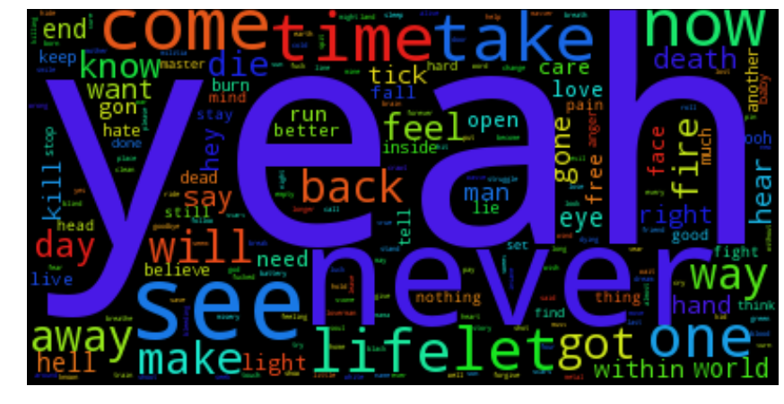
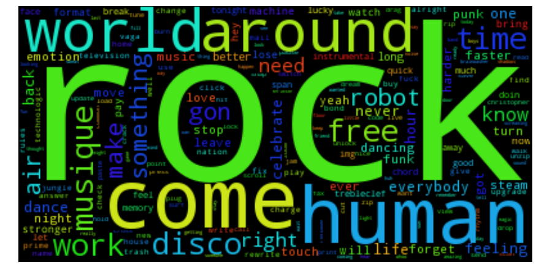
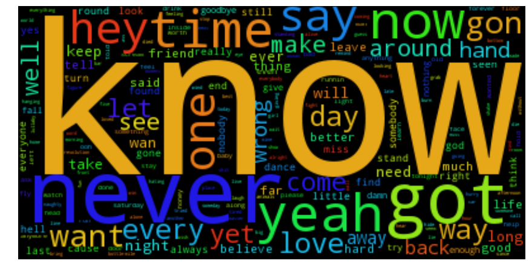

# Lyrics Word Cloud Generator

A Jupyter notebook for generating Word Clouds from artist lyrics.

## Running

```
git clone https://github.com/danisla/lyrics_word_cloud.git
cd lyrics_word_cloud
docker-compose up -d
```

## Examples:

**Metallica** ohh _yeah_



**Daft Punk** knows how to _rock_ _around_ the _world_



Despite what the data may say, **Nickleback** just doesn't _know_ when to stop writing [crappy music](http://lmgtfy.com/?q=worst+band+in+the+world).
[](http://lmgtfy.com/?q=worst+band+in+the+world)
